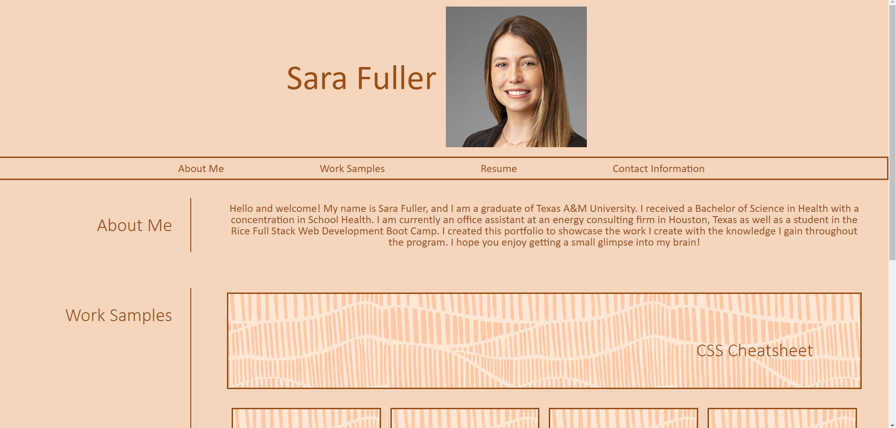

# Sara-Fuller-Portfolio

https://sarafuller2018.github.io/Sara-Fuller-Portfolio/ 

## Description

This is a portfolio to showcase the work I create throughout the duration of the Rice University Coding Bootcamp. Throughout creating the webpage code, I was able to apply my knowledge and practice using responsive design by including flexboxes and media queries.  

## Installation

N/A

## Usage

Each section of the webpage contains information useful to future employers about me and the work I have created. Once selected, the cards in the "Work Samples" section will take the user to a deployed site that I created. 

## Credits

Work Samples background photo -- (https://www.istockphoto.com/photos/boho)

## License

Please refer to the LICENSE in the repo.

## Screenshot of Website

